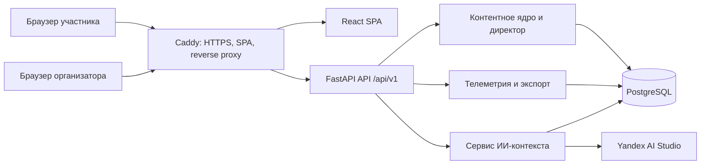
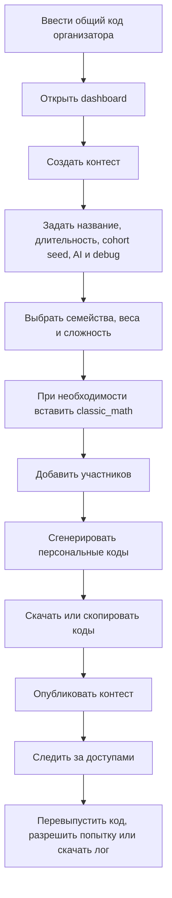
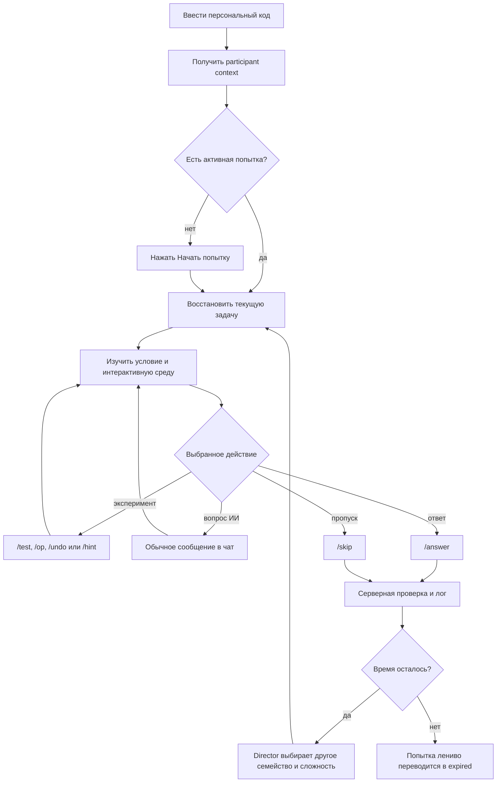
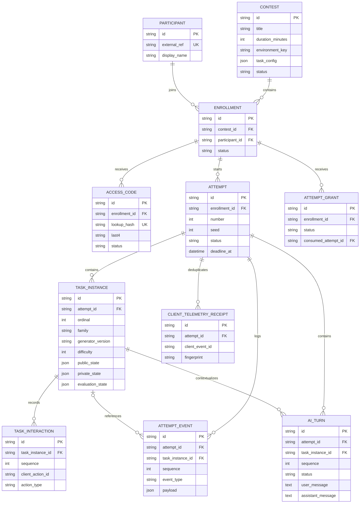
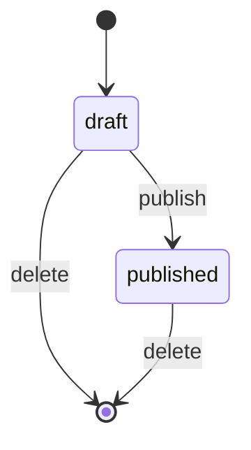
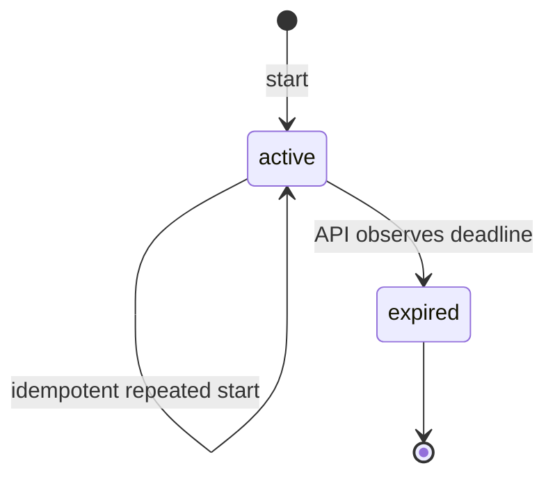
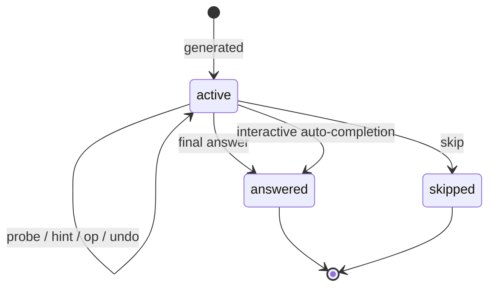
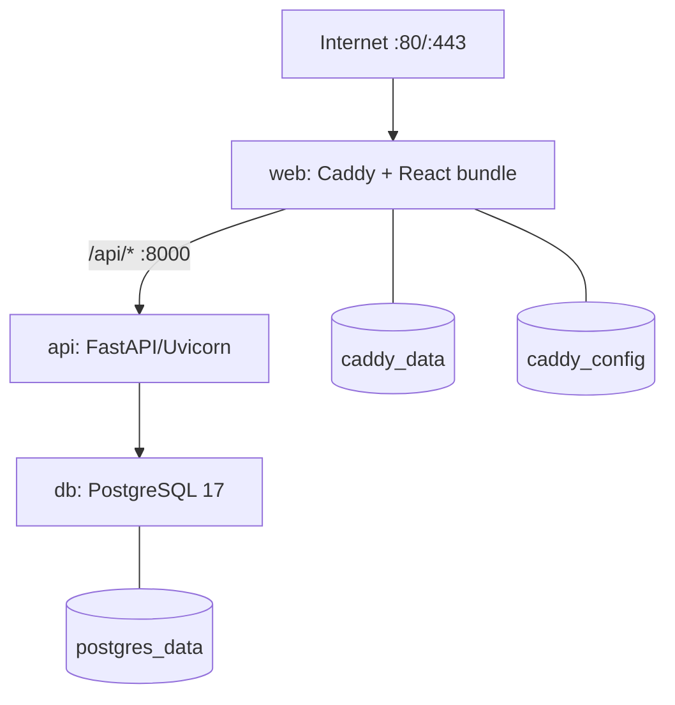

# Sirius Gate — полная техническая документация

> Актуально для ветки `feature/content-v3`, базовая ревизия `35a219e`, 5 августа 2026 года.

Этот документ описывает фактическое состояние работающего кода Sirius Gate: архитектуру, пользовательские сценарии, модель данных, генерацию задач, адаптацию, скоринг, ИИ-ассистента, телеметрию, API, локальный запуск и production-развёртывание.

Источником истины считаются код, миграции и тесты. Корневой `README.md` и `backend/README.md` частично устарели: в них всё ещё встречаются Chess960, Penultima, `nim_like`, `geo_graph` и команды, которые не подключены к текущему runtime.

## Содержание

1. [Назначение платформы](#1-назначение-платформы)
2. [Текущее состояние и границы MVP](#2-текущее-состояние-и-границы-mvp)
3. [Архитектура системы](#3-архитектура-системы)
4. [Технологический стек](#4-технологический-стек)
5. [Структура репозитория](#5-структура-репозитория)
6. [Роли и пользовательские сценарии](#6-роли-и-пользовательские-сценарии)
7. [Frontend](#7-frontend)
8. [Backend и API](#8-backend-и-api)
9. [Авторизация и персональные коды](#9-авторизация-и-персональные-коды)
10. [Модель данных](#10-модель-данных)
11. [Жизненный цикл контеста, попытки и задачи](#11-жизненный-цикл-контеста-попытки-и-задачи)
12. [Контентное ядро](#12-контентное-ядро)
13. [Адаптивная траектория](#13-адаптивная-траектория)
14. [Скоринг](#14-скоринг)
15. [ИИ-ассистент](#15-ии-ассистент)
16. [Телеметрия и экспорт логов](#16-телеметрия-и-экспорт-логов)
17. [Конфигурация](#17-конфигурация)
18. [Локальная разработка](#18-локальная-разработка)
19. [Production-развёртывание](#19-production-развёртывание)
20. [Обновление, резервное копирование и откат](#20-обновление-резервное-копирование-и-откат)
21. [Тестирование и CI](#21-тестирование-и-ci)
22. [Безопасность, приватность и известные ограничения](#22-безопасность-приватность-и-известные-ограничения)
23. [Как добавить новое семейство задач](#23-как-добавить-новое-семейство-задач)
24. [Карта основных файлов](#24-карта-основных-файлов)
25. [Краткий справочник команд](#25-краткий-справочник-команд)

## 1. Назначение платформы

Sirius Gate — экспериментальная платформа для проведения интеллектуальных отборов школьников. Основная идея состоит не только в проверке итогового ответа, но и в наблюдении за процессом решения:

- участник входит по персональному коду;
- запускает ограниченную по времени попытку;
- последовательно получает процедурно сгенерированные задачи;
- взаимодействует с задачей и ИИ через единое текстовое окно;
- может отвечать, проводить разрешённые эксперименты, просить подсказку, обращаться к ИИ или пропускать задачу;
- система формально проверяет ответы, адаптирует дальнейшую траекторию и сохраняет хронологию событий;
- организатор скачивает текстовый лог участника для последующего анализа.

Платформа сейчас является техническим инструментом пилотной апробации, а не завершённой психометрической системой. Она собирает сырой материал для анализа, но не рассчитывает валидированную оценку математической способности и не принимает автоматическое решение об отборе.

## 2. Текущее состояние и границы MVP

### Реализовано

- вход организатора и участника по коду;
- персональная связь `контест → регистрация → код → участник`;
- конструктор смешанного контеста;
- десять процедурных ротационных семейств задач;
- одна опциональная скриптовая классическая задача в заданной позиции;
- индивидуальная часовая или иная ограниченная по времени попытка;
- адаптивная, детерминированно воспроизводимая траектория;
- запрет двух одинаковых семейств подряд, если включено более одного семейства;
- серверная формальная проверка задач;
- официальный бинарный скоринг `0/1` за завершённую задачу;
- исследовательские непрерывные показатели качества решения;
- ИИ-ассистент через Yandex AI Studio;
- серверная и клиентская телеметрия;
- скачивание UTF-8 `.txt`-лога участника;
- повторная попытка по разрешению организатора;
- Docker Compose-развёртывание с PostgreSQL, FastAPI и Caddy;
- автоматические миграции, health checks, резервные копии и откат кода;
- CI для frontend, backend и production-контейнеров.

### Не реализовано

- итоговый рейтинг участников и автоматическое решение о зачислении;
- валидированная методологическая модель способности;
- отдельный экран ручной проверки развёрнутых решений;
- загрузка сканов письменных работ;
- этап программирования с sandbox-запуском кода;
- редактирование опубликованного контеста через UI;
- явная кнопка завершения всей попытки до дедлайна;
- автоматическое удаление персональных данных через 30 дней;
- отдельные роли нескольких организаторов;
- refresh tokens, восстановление пароля или обычные аккаунты;
- frontend E2E- и component-тесты;
- активные Chess960, Penultima, `nim_like` и `geo_graph`.

### Термины статуса контента

- **Активное семейство** — доступно в реестре, API, конструкторе и participant UI.
- **Совместимость** — код умеет открыть или проверить ранее сохранённую версию, но новые задачи этой версии не создаются.
- **Неподключённый эксперимент** — файл или прежняя идея не импортируется реестром и не является функцией платформы.

## 3. Архитектура системы

Sirius Gate построен как модульный монолит. Frontend, API, контентные движки и хранилище разделены по модулям, но backend разворачивается одним сервисом. Для пилота это уменьшает эксплуатационную сложность и сохраняет атомарность операций с попытками, задачами и логами.



### Компоненты верхнего уровня

| Компонент | Ответственность |
|---|---|
| React SPA | Вход по коду, конструктор контеста, рабочее место участника, локальный таймер, команды, визуализация задач, очередь клиентской телеметрии |
| FastAPI | Авторизация, CRUD контестов, жизненный цикл попыток, выдача задач, проверка ответов, интеракции, ИИ, телеметрия и экспорт |
| Контентный registry | Связывает ключ семейства и версию генератора с генерацией, проверкой и допустимыми интеракциями |
| Director | Выбирает следующее семейство и сложность по конфигурации и истории участника |
| PostgreSQL | Каноническое хранилище контестов, участников, кодов, попыток, задач, интеракций, диалогов и событий |
| Yandex AI Studio | Внешний OpenAI-compatible endpoint для ответов встроенного ассистента |
| Caddy | TLS, сжатие, security headers, раздача frontend и проксирование `/api/*` |
| Docker Compose | Совместный запуск `web`, `api`, `db`, сетей и постоянных volumes |
| GitHub Actions | Проверка TypeScript, сборка frontend, backend-тесты, миграции и контейнерный persistence smoke test |

### Важные архитектурные свойства

- Клиент никогда не получает `private_state`, seed или эталонный ответ, кроме явно включённого debug-режима.
- Все формальные решения принимает сервер; визуальный интерфейс не считается доверенным.
- Внешний ИИ не имеет инструментов и не может менять состояние задачи.
- Одна активная попытка и одна активная задача на участника обеспечиваются ограничениями БД.
- Пошаговые интеракции и клиентские события идемпотентны по переданному идентификатору.
- Конфигурация контеста фиксируется snapshot-ом при старте попытки.
- WebSocket и streaming сейчас не используются: чат работает обычными HTTP-запросами.

## 4. Технологический стек

| Слой | Технология | Для чего используется |
|---|---|---|
| Язык frontend | TypeScript 6 | Статическая типизация UI и API-клиента |
| UI | React 19.2, React DOM 19.2 | Компоненты и состояние SPA |
| Сборка frontend | Vite 8.1, React plugin | Dev server, proxy и production bundle |
| Стили | Обычный CSS | Палитра, responsive layout, компоненты и визуальные сцены |
| Маршрутизация | Browser History API | Ручные пути `/`, `/organizer`, `/contest`; React Router не используется |
| Язык backend | Python 3.11+; Python 3.12 в Docker/CI | API и контентное ядро |
| HTTP API | FastAPI 0.115+ | REST endpoints, зависимости и валидация |
| ASGI server | Uvicorn 0.34+ | Запуск FastAPI в production |
| Схемы и конфигурация | Pydantic Settings 2.7+ | Env-конфигурация и API-модели |
| ORM | SQLAlchemy 2 | Синхронные транзакции и модель данных |
| Production DB | PostgreSQL 17 | Основное постоянное хранилище |
| Development DB | SQLite | Быстрый локальный запуск и часть тестов |
| Миграции | Alembic 1.14+ | Версионирование production-схемы |
| PostgreSQL driver | psycopg 3 binary | Соединение SQLAlchemy с PostgreSQL |
| HTTP client | httpx 0.28+ | Запросы к Yandex AI Studio |
| Шахматная логика | python-chess 1.999 | Легальные позиции и ходы Dice & Chess |
| Графы и геометрия | Собственные структуры и алгоритмы Python | Генерация, признаки, связность, циклы, инварианты и точный перебор |
| Отрисовка графов | Inline SVG в React | Координаты, рёбра и вершины без NetworkX/D3 на клиенте |
| Reverse proxy | Caddy 2.11 | HTTPS, static files, API proxy и security headers |
| Контейнеры | Docker, Docker Compose | Production-сервисы и volumes |
| Тесты backend | pytest 8 | API, генераторы, директор, AI, телеметрия и миграции |
| CI | GitHub Actions | Автоматическая проверка push и pull request |

NetworkX в текущем проекте не используется. Для небольших процедурных графов собственные структуры дают воспроизводимость, полный контроль над сериализацией и отсутствие тяжёлой runtime-зависимости. Сервер передаёт узлы, координаты и рёбра как JSON, а React рисует их SVG-элементами.

## 5. Структура репозитория

```text
sirius_test/
├── src/                         React frontend
│   ├── App.tsx                  маршрутизация и оркестрация экранов
│   ├── api.ts                   типизированный HTTP-клиент и runtime-парсинг
│   ├── auth.ts                  sessionStorage и access session
│   ├── components.tsx           общие UI-компоненты и логотип
│   ├── organizer/               конструктор и панель доступов
│   └── participant/             рабочая зона, чат, визуализаторы, телеметрия
├── public/                      статические assets
├── backend/
│   ├── app/
│   │   ├── main.py              фабрика FastAPI-приложения
│   │   ├── api.py               все REST-маршруты и runtime orchestration
│   │   ├── models.py            SQLAlchemy-модель данных
│   │   ├── schemas.py           Pydantic-схемы API
│   │   ├── security.py          коды, HMAC и Bearer token
│   │   ├── dependencies.py      auth-зависимости FastAPI
│   │   ├── telemetry.py         формирование текстового экспорта
│   │   ├── ai/                  контекст, prompt, provider и AI service
│   │   └── environments/        генераторы, evaluator-ы и director
│   ├── alembic/                 production-миграции
│   ├── tests/                   backend test suite
│   ├── Dockerfile               production API image
│   └── docker-entrypoint.sh     миграции и запуск Uvicorn
├── deploy/                      Caddy и эксплуатационные сценарии
├── .github/workflows/ci.yml     CI pipeline
├── compose.yml                  production topology
├── Dockerfile.frontend          Node build + Caddy runtime
├── vite.config.ts               dev server и API proxy
└── package.json                 frontend scripts и зависимости
```

`dist/`, локальная SQLite-база, virtual environment, secrets и production backups не являются исходным кодом и не должны коммититься.

## 6. Роли и пользовательские сценарии

### Организатор



Конструктор состоит из четырёх этапов:

1. **Параметры** — название, длительность 15–240 минут, необязательный `cohort_seed`, debug-ответы, режим и лимиты ИИ.
2. **Семейства** — включение, вес, начальная и максимальная сложность 1–5; отдельная настройка скриптовой классической задачи.
3. **Участники** — внешний ID и отображаемое имя.
4. **Коды** — выпуск кодов, локальный CSV-экспорт и публикация.

Новые контесты из UI всегда создаются как `mixed` с `director-v2`. Отдельного выбора старых `chess_world` и `geometry_world` в интерфейсе нет.

### Сценарий участника



Таймер начинается только после явного запуска попытки, а не при вводе кода. Количество задач заранее не ограничено: участник решает столько, сколько успевает до server deadline.

## 7. Frontend

### 7.1. Точка входа и маршруты

`src/main.tsx` монтирует `App` внутри `React.StrictMode`.

`src/App.tsx` использует ручную маршрутизацию:

| Путь | Состояние |
|---|---|
| `/` | форма ввода кода |
| `/organizer` | dashboard, конструктор и доступы организатора |
| `/contest` | ожидание старта или рабочее место участника |

Ожидаемый путь выводится из роли текущей сессии. Неизвестный путь заменяется через `history.replaceState`.

### 7.2. Сессия браузера

`src/auth.ts` хранит versioned access session в `sessionStorage`, отдельно для вкладки браузера. Сохраняются:

- Bearer token;
- роль;
- маска введённого кода;
- время выпуска и истечения токена;
- безопасные summaries контеста, участника, регистрации и попытки.

Открытый персональный код не сохраняется. Повреждённая или истёкшая запись удаляется. Cookies, refresh token и фоновое продление токена отсутствуют.

### 7.3. API-клиент

`src/api.ts`:

- использует `/api/v1` по умолчанию;
- поддерживает build-time `VITE_API_BASE_URL`;
- добавляет `Authorization: Bearer ...`;
- нормализует snake_case и camelCase;
- строго проверяет публичные виды задач;
- преобразует ошибки в единый `ApiError`;
- поддерживает скачивание telemetry-файла по `Content-Disposition`.

При неизвестном `public_state.kind` клиент выдаёт `unsupported_task_kind` вместо попытки отрисовать непроверенные данные.

### 7.4. UI организатора

| Компонент | Назначение |
|---|---|
| `ContestBuilder.tsx` | Четырёхэтапное создание контеста, конфигурация контента, участников и кодов |
| `ContestAccessPanel.tsx` | Состояния кода/попытки, ротация кода, grant новой попытки, скачивание лога |
| `App.tsx` | Список контестов, открытие экранов и каскадное удаление после подтверждения |

Открытые коды существуют в React state только сразу после выпуска или ротации. CSV формируется в браузере с UTF-8 BOM и разделителем `;`.

### 7.5. Рабочее место участника

`ParticipantWorkspace.tsx` содержит две основные зоны:

- условие и интерактивная сцена;
- чат-команды и диалог с ИИ.

Поддержанные визуализаторы:

- шахматная доска и кубики;
- SVG-графы, точки и геометрические фигуры;
- цветные числовые фишки;
- редактируемая сетка 5×5;
- лампы и пары кнопок скрытой проводки;
- панели конечных машин;
- доска прыгуна;
- интерактивный развёрнутый лист «Дырокола»;
- текст и таблица классической задачи.

После финального ответа или пропуска frontend автоматически запрашивает следующую задачу. `/next` остаётся восстановительной командой на случай, если ответ уже сохранён, а следующий HTTP-запрос прервался.

### 7.6. Команды

| Команда | Где доступна | Действие |
|---|---|---|
| `/help` | всегда | Показывает контекстную справку |
| `/answer <текст>` | активная задача | Отправляет финальный ответ |
| `/test <код>` | Zendo | Проверяет предложенный пример |
| `/probe <код>` | Zendo | Alias команды `/test` |
| `/hint` | Zendo, hidden wiring | Один раз раскрывает категорию правила и применяет штраф к continuous score |
| `/op <id>` | machine, hidden wiring | Применяет операцию или пару кнопок |
| `/undo` | machine | Отменяет последний шаг состояния, но не стирает факт действия из лога |
| `/skip` | активная задача | Фиксирует пропуск с нулём и открывает следующую задачу |
| `/next` | закрытая задача | Повторяет переход к следующей задаче |
| `/get answer` | только debug contest | Получает эталон и скрытые детали; событие логируется |
| `done` / `готово` | machine | Заявляет, что цель достигнута |
| `impossible` / `невозможно` | machine | Заявляет недостижимость цели |

Обычный текст без начального `/` отправляется ИИ. Неизвестная slash-команда не передаётся модели.

### 7.7. CSS и assets

- Общие токены, типографика и layout находятся в `src/styles.css`.
- Builder, access panel и participant workspace имеют отдельные CSS-файлы.
- CSS Modules, Sass, Tailwind и UI-kit не используются.
- Логотип находится в `public/header_logo_new.png`.
- Иконки и игровые сцены в основном строятся inline SVG и HTML/CSS.
- Montserrat и Roboto Mono загружаются из Google Fonts; при недоступной сети используются системные fallback-шрифты.
- Поддерживаются responsive breakpoints и `prefers-reduced-motion`.

Технический долг frontend: `participant-workspace.css` содержит несколько поколений поздних cascade override-ов, а `styles.css` — часть старых неиспользуемых правил. Перед крупным редизайном стили стоит разделить по визуализаторам и удалить дубли.

## 8. Backend и API

Backend — синхронный FastAPI-монолит. Все route handler-ы объявлены обычными `def`; FastAPI выполняет их в thread pool. Async ORM, message broker, фоновые workers и отдельный scheduler отсутствуют.

### 8.1. Запуск приложения

`backend/app/main.py` создаёт:

- объект `Database`;
- один AI provider на процесс;
- FastAPI-приложение;
- CORS middleware;
- router с префиксом `/api/v1`.

В development SQLAlchemy вызывает `create_all()`. В production создание схемы отключено: перед стартом Uvicorn выполняется `alembic upgrade head`.

Swagger, ReDoc и OpenAPI доступны только вне production:

- `/docs`;
- `/redoc`;
- `/openapi.json`.

### 8.2. Формат ошибок

Прикладные ошибки возвращаются в форме:

```json
{
  "detail": {
    "code": "MACHINE_READABLE_CODE",
    "message": "Понятное пользователю сообщение"
  }
}
```

### 8.3. Публичные маршруты

| Метод и путь | Назначение |
|---|---|
| `GET /api/v1/health` | Liveness процесса |
| `GET /api/v1/ready` | Readiness с `SELECT 1` к БД |
| `POST /api/v1/access/redeem` | Обмен кода на Bearer token |

### 8.4. Маршруты организатора

| Метод и путь | Назначение |
|---|---|
| `GET /contests` | Список контестов с `task_config` |
| `POST /contests` | Создание draft-контеста |
| `DELETE /contests/{contest_id}` | Каскадное удаление контеста и его данных |
| `POST /contests/{contest_id}/enrollments` | Добавление до 1000 участников одним запросом |
| `GET /contests/{contest_id}/enrollments` | Участники, последний код, последняя попытка и pending grant |
| `GET /contests/{contest_id}/enrollments/{enrollment_id}/telemetry` | Скачать UTF-8 telemetry log |
| `GET /contests/{contest_id}/enrollments/{enrollment_id}/telemetry/summary` | Сформировать Alice AI-саммари и скачать Markdown |
| `POST /contests/{contest_id}/codes` | Массовый выпуск кодов |
| `POST /contests/{contest_id}/enrollments/{enrollment_id}/codes/rotate` | Отозвать старый и выпустить новый код |
| `POST /contests/{contest_id}/enrollments/{enrollment_id}/attempts/grant` | Разрешить одну следующую попытку |
| `POST /contests/{contest_id}/publish` | Опубликовать контест |

Пути в этой и следующей таблице также имеют общий префикс `/api/v1`.

### 8.5. Маршруты участника

| Метод и путь | Назначение |
|---|---|
| `GET /participant/context` | Безопасные сведения о контесте и активной попытке |
| `POST /participant/telemetry` | Клиентское событие |
| `POST /participant/attempts/start` | Создать или вернуть активную попытку |
| `GET /participant/tasks/current` | Вернуть активную задачу; при отсутствии может создать новую |
| `POST /participant/tasks/next` | Создать или вернуть следующую задачу после закрытия текущей |
| `POST /participant/tasks/{task_id}/interactions` | `probe`, `hint`, `apply_op`, `undo`, `reset` |
| `GET /participant/tasks/{task_id}/debug-answer` | Эталон при включённом debug-режиме |
| `POST /participant/tasks/{task_id}/ai/turns` | Новый запрос ИИ |
| `GET /participant/tasks/{task_id}/ai/turns` | История завершённых AI-turns |
| `POST /participant/tasks/{task_id}/answer` | Финальный ответ |
| `POST /participant/tasks/{task_id}/skip` | Пропуск задачи |

`GET /participant/tasks/current` не является чистым чтением: при отсутствии активной задачи он может сгенерировать и записать следующую. Некоторые read endpoints также лениво отмечают просроченную попытку как `expired`.

### 8.6. Конкурентность и идемпотентность

- Мутации участника блокируют активную попытку или задачу через `SELECT ... FOR UPDATE` в PostgreSQL.
- Уникальные ограничения не допускают две активные попытки или задачи.
- `TaskInteraction.client_action_id` предотвращает двойное применение операции.
- Повтор того же action ID с тем же payload возвращает сохранённый результат.
- Повтор того же action ID с другим payload возвращает конфликт `409`.
- Клиентская телеметрия использует аналогичный event ID и fingerprint.
- AI-turn идемпотентен по `client_action_id` внутри попытки.

## 9. Авторизация и персональные коды

### 9.1. Код организатора

Организатор входит по одному общему секрету `ORGANIZER_CODE`. Сравнение выполняется через `hmac.compare_digest`. После успешного ввода сервер выпускает stateless HS256 Bearer token.

### 9.2. Код участника

Формат:

```text
SG-XXXX-XXXX
```

Алфавит исключает неоднозначные символы. Генерация использует криптографически стойкий `secrets.choice`.

В базе хранятся только:

- HMAC-SHA256 нормализованного кода;
- последние четыре символа;
- статус и даты выпуска, истечения, первого использования и отзыва.

Открытый код возвращается только при генерации или ротации. Код не одноразовый: до отзыва или истечения его можно снова обменивать на новый token.

### 9.3. Bearer token

Токен имеет JWT-совместимую трёхчастную структуру с HS256 и содержит:

- `sub`;
- `role`;
- `iat`;
- `exp`;
- `jti`;
- для участника — `enrollment_id`, `contest_id`, `access_code_id`.

Срок participant token не может превышать срок кода. На каждом защищённом participant-запросе сервер дополнительно проверяет, что код всё ещё активен и регистрация не отключена. Поэтому ротация кода немедленно инвалидирует ранее выданный participant token.

Organizer token не имеет серверной сессии и не может быть точечно отозван до `exp`; экстренный глобальный отзыв выполняется сменой `SECURITY_SECRET`.

## 10. Модель данных



### 10.1. Таблицы и инварианты

| ORM / таблица | Назначение | Главные ограничения |
|---|---|---|
| `Contest / contests` | Конфигурация и статус испытания | `draft/published`; удаление каскадирует registrations |
| `Participant / participants` | Глобальная запись человека | `external_ref` уникален во всей системе |
| `Enrollment / enrollments` | Связь человека с контестом | Уникальна пара contest + participant |
| `AccessCode / access_codes` | Персональный доступ | Уникален HMAC; не более одного active slot на enrollment |
| `Attempt / attempts` | Отдельный временной запуск | Уникален номер; не более одной активной попытки |
| `AttemptGrant / attempt_grants` | Одноразовое разрешение повторного запуска | Не более одного pending grant |
| `TaskInstance / task_instances` | Сгенерированная задача | Уникален ordinal; не более одной active task |
| `TaskInteraction / task_interactions` | Пошаговое действие внутри задачи | Уникальны sequence и client action ID внутри task |
| `AiTurn / ai_turns` | Полный диалог и metadata провайдера | Уникальны task sequence и attempt client action ID |
| `ClientTelemetryReceipt` | Дедупликация client telemetry | Уникален client event ID внутри attempt |
| `AttemptEvent / attempt_events` | Append-only по соглашению журнал | Уникальна sequence внутри attempt |

Паттерн `active_slot=True/NULL` и `pending_slot=True/NULL` позволяет переносимо реализовать частичный unique constraint: завершённые записи получают `NULL`, а активная — единственное значение `True`.

### 10.2. Статусы

| Сущность | Значения | Фактическое использование |
|---|---|---|
| Contest | `draft`, `published` | оба используются |
| Enrollment | `registered`, `disabled` | API создаёт только `registered`; отключение зарезервировано |
| AccessCode | `active`, `revoked`, `expired` | все используются |
| Attempt | `active`, `completed`, `expired` | `completed` зарезервирован; текущая попытка заканчивается через `expired` |
| AttemptGrant | `pending`, `consumed` | оба используются |
| Task | `active`, `answered`, `skipped` | все используются |
| AiTurn | `pending`, `completed`, `failed`, `cancelled` | `cancelled` зарезервирован |

### 10.3. Удаление

Удаление контеста каскадно удаляет его registrations, codes, attempts, tasks, interactions, AI transcripts и events. Глобальная запись `Participant` остаётся. В UI удаление обозначено как необратимое.

## 11. Жизненный цикл контеста, попытки и задачи

### 11.1. Контест



- Участников можно добавлять через текущий API только в draft.
- Participant redeem разрешён только после публикации.
- Publish идемпотентен.
- Удаление разрешено и для draft, и для published.

### 11.2. Попытка



- Первая попытка не требует разрешения.
- Каждая следующая требует одного pending `AttemptGrant`.
- Grant не запускает таймер; он потребляется только при `start`.
- Deadline проверяется лениво при API-вызове; фонового scheduler нет.
- Явного «закончить попытку» нет.
- Активная задача при истечении попытки может исторически остаться со статусом `active`.

При старте в event `attempt_started` сохраняются:

- snapshot `environment_key`;
- snapshot полного `task_config`;
- hash конфигурации;
- время старта и deadline;
- seed попытки.

Дальнейшие задачи и ИИ читают snapshot, поэтому изменение исходного `Contest` не меняет уже начатую попытку.

### 11.3. Задача



Некоторые evaluator-ы могут вернуть `should_finalize=false`. Тогда задача остаётся активной. Например, неверный формат hidden wiring, `done` до достижения цели или ложный `impossible` не закрывают задачу.

## 12. Контентное ядро

### 12.1. Общая модель задачи

Каждая задача определяется четверкой:

```text
family + generator_version + seed + difficulty
```

Генератор возвращает:

- `public_state` — условие и данные, безопасные для участника;
- `private_state` — скрытое правило, эталон, witness, сертификат и runtime-состояние.

Evaluator получает ответ и `private_state`, а затем возвращает оценку. Registry является единой точкой диспетчеризации генераторов, evaluator-ов и интеракций.

Базовый seed задачи вычисляется как SHA-256 от:

```text
[attempt_seed, ordinal, family_namespace, generator_version]
```

Используются первые восемь байт с маской безопасного signed 63-bit integer. Версия генератора сохраняется в задаче, чтобы старый экземпляр всегда проверялся совместимой логикой.

### 12.2. Активные семейства

| Семейство | Версия новых задач | Тип | Что проверяется |
|---|---|---|---|
| `chess_coverage` | `chess-coverage-v1` | интерактив | оптимизация покрытия и сравнение взвешенных решений |
| `geo_zendo` | `geometry-zendo-v2` в mixed | интерактив | индукция скрытого правила на графах |
| `token_zendo` | `token-zendo-v1` | интерактив | закономерности чисел, цветов и порядка |
| `point_zendo` | `point-zendo-v1` | интерактив | геометрические свойства конфигураций точек |
| `grid_zendo` | `grid-zendo-v1` | интерактив | симметрия, связность, чётность и конструкции 5×5 |
| `hidden_wiring` | `hidden-wiring-v1` | интерактив | эксперимент, линейность над GF(2), планирование |
| `machine_reach` | `machine-reach-v1` | интерактив | достижимость, инварианты и поиск последовательности |
| `fold_punch` | `fold-punch-v1` | ответ/UI | пространственное мышление и композиция отражений |
| `geo_transform` | `geometry-atlas-v1` | ответ | преобразования группы D4 |
| `geo_probability` | `geometry-atlas-v1` | ответ | точная комбинаторика на графах |
| `classic_math` | `classic-math-v1` | скриптовая вставка | развёрнутый вывод и наличие обоснования |

Новые mixed-контесты содержат десять ротационных семейств. `classic_math` существует отдельно от ротации и может появиться ровно один раз на позиции 1–100.

### 12.3. Шахматное покрытие и совместимость

В новых контестах шахматное семейство использует доску 5×5–7×7. На ней
показаны кандидаты-фигуры с индивидуальными положительными весами и целевые
клетки. Участник выбирает подмножество фигур так, чтобы все цели оказались под
боем, и минимизирует суммарный вес. Линии боя в этой абстракции не
перекрываются другими фигурами. Сервер перебирает все подмножества кандидатов,
поэтому оптимум проверяется точно; генератор принимает только экземпляры с
единственным оптимальным решением. Выбор фигур и сброс расстановки сохраняются
как идемпотентные интеракции.

Dice & Chess сохранён для ранее созданных контестов.

Сложности 1–2:

- на доске 8×8 размещаются 8–16 условных фигур;
- позиция не обязана быть легальной шахматной;
- грани шестигранного кубика соответствуют типам фигур;
- на уровне 1 событие относится ко всей доске;
- на уровне 2 — к выбранной области доски.

С уровня 3:

- строится легальная позиция после случайного playout;
- сторона хода фиксирована;
- для типов фигур подсчитываются легальные ходы;
- возможны события про наличие хода, взятия и, с уровня 5, шахующего хода.

Вероятность считается точно по шести равновероятным граням. Ответ может быть дробью, десятичным числом с точкой/запятой или процентом. Допуск — `0.005`.

### 12.4. Общий движок Zendo

В mixed четыре Zendo-семейства используют общий engine:

- 4 обучающих примера: 2 положительных и 2 отрицательных;
- 5 разрешённых проб;
- 8 целевых конфигураций;
- начальное пространство из 8–64 непротиворечивых гипотез;
- атомарные правила и композиции `NOT`, `AND`, `OR`, `XOR`;
- семантическая дедупликация правил по минимальной MDL-сложности;
- уровни 1–5 соответствуют корзинам описательной сложности правила;
- target-примеры строятся как near-miss: четыре меняют значение правила, четыре сохраняют;
- telemetry пробы фиксирует размер version space и информационный выигрыш.

Итоговый ответ — восемь yes/no значений. Принимаются `да/нет`, `yes/no`, `1/0`, `true/false`, `+/-`.

#### `geo_zendo`

Работает с небольшими графами. Атомы включают:

- чётность числа вершин и рёбер;
- отношение `edges ≥ vertices` и плотность;
- изолированную или висячую вершину;
- максимальную степень;
- чётность степеней;
- связность;
- треугольник и цикл;
- двудольность;
- пересечение рёбер на конкретном рисунке.

#### `token_zendo`

Последовательности длины 3–7 из чисел 1–9 и цветов R/G/B. Правила относятся к сумме, чётности, палиндромности, цветам, диапазону, сумме квадратов и взаимной простоте соседей.

#### `point_zendo`

Наборы из 5–8 точек на решётке. Правила относятся к коллинеарности, выпуклому положению, различию расстояний, центральной симметрии, параллелограммам и четырём точкам на окружности.

#### `grid_zendo`

Узоры 5×5. Правила относятся к:

- числу заполненных клеток;
- связности и числу компонент;
- семи нетривиальным симметриям D4;
- чётности строк и столбцов;
- возможности замощения домино.

В отличие от карточных проб других Zendo, здесь участник самостоятельно рисует произвольный 25-битный узор.

### 12.5. Hidden Wiring

Скрытая проводка моделируется как линейная система над GF(2): кнопки срабатывают только парами, а их эффекты на лампы скрыты.

Варианты:

- `reach_target` — экспериментировать с парами и привести панель к цели; задача автоматически закрывается при достижении состояния;
- `predict_chords` — изучить доступные пары, а затем предсказать эффект трёх экзаменационных комбинаций.

Первая проба учебная и не расходует отображаемый бюджет. Бюджет — восемь последующих пар, при этом внутренний код допускает до девяти действий вместе с учебным. Каждая принятая пара записывает изменение пространства гипотез и информационный выигрыш.

### 12.6. Machine Reach

Четыре подтипа выбираются seed-детерминированно из разрешённого списка:

| Подтип | Механика | Формальный инвариант/солвер |
|---|---|---|
| `lamps_gf2` | Переключение групп ламп | Ранг и span над GF(2) |
| `numeric_machine` | Целочисленные аффинные операции | BFS и остаток по модулю |
| `perm_puzzle` | Перестановка карточек | BFS и чётность перестановки |
| `leaper_board` | Прыгун на доске с препятствиями | BFS, компоненты и раскраска |

Достижимые и недостижимые экземпляры чередуются детерминированно примерно поровну. Участник применяет `/op`, может использовать `/undo`, затем отвечает `done` или `impossible`.

Достижение target в `machine_reach` само по себе не закрывает задачу: требуется `done`. Ложный `impossible` оставляет задачу активной и блокирует input на 15 секунд.

### 12.7. Fold Punch

Лист 8×8 несколько раз складывается, после чего в сложенном листе пробиваются отверстия. Участник отмечает все клетки после разворачивания.

| Сложность | Генерация |
|---|---|
| 1 | два прямых сгиба, одно отверстие |
| 2 | два прямых сгиба, два отверстия |
| 3 | три прямых сгиба, два отверстия |
| 4–5 | два прямых и один диагональный сгиб, два отверстия |

Генератор сверяет прямую модель слоёв с независимым обратным разворачиванием. Ответ — множество координат `строка,столбец` с нумерацией от 1.

### 12.8. Geo Transform

Показываются исходная фигура и её образ. Участник выбирает карточку преобразования `Tn`.

- уровень 1: тождество и повороты;
- уровень 2: добавляются отражения по осям;
- уровень 3+: доступны все восемь элементов D4.

### 12.9. Geo Probability

Строится связный граф на 5–8 вершинах. Возможные события:

- случайная пара соединена ребром;
- случайная вершина имеет чётную степень;
- у случайной пары есть общий сосед;
- концы случайного ребра имеют разные цвета;
- случайная тройка образует треугольник.

Сервер перебирает конечное пространство исходов. Принимается точная дробь `p/q` либо `0`/`1`; десятичный и процентный формат здесь не поддерживается.

### 12.10. Classic Math

Скриптовая вставка имеет два варианта:

- `share_paradox` — объяснить расхождение помесячных и суммарных долей;
- `bar_seating` — назвать оптимальное первое место, максимум посетителей и обосновать оптимальность.

Задача не участвует в весах и адаптивной ротации, всегда имеет сложность 1 и появляется один раз в указанной позиции.

Текущий автоматический judge проверяет точный итог, наличие маркера `Обоснование:` и минимальный объём текста. Он **не проверяет математическую корректность самого доказательства**. Полный ответ сохраняется в лог для ручного анализа.

### 12.11. Совместимость и неподключённый контент

Registry сохраняет поддержку исторических Dice & Chess версий:

- `dice-chess-mission-v2`;
- `dice-chess-probability-v1`;
- `dice-chess-position-probability-v1`.

Новые задачи этих версий не выбираются.

В `geometry_world` `geo_zendo` продолжает использовать legacy `geometry-atlas-v1`, а не общий Zendo v2. Новые контесты из UI используют `mixed`, поэтому получают v2.

Chess960, Penultima, `nim_like`, `geo_graph` и их команды не входят в активный registry. Наличие экспериментального файла в локальном рабочем дереве само по себе не делает семейство доступным через API.

## 13. Адаптивная траектория

### 13.1. `director-v2`

Новые mixed-контесты используют `director-v2`.

Алгоритм:

1. Если задан `start_family`, первая задача берётся из него.
2. Каждое включённое семейство получает хотя бы одну калибровочную встречу.
3. Далее семейства выбираются по weighted coverage debt: директор компенсирует отставание фактической доли показов от настроенного веса.
4. При двух и более семействах последнее семейство исключается из следующего выбора независимо от правильности, ошибки или пропуска.
5. При достаточном оставшемся времени soft quota стремится дать минимум три встречи с каждым семейством.
6. Сложность ведётся отдельно по каждому семейству.

Сигнал результата:

| Результат | Evidence |
|---|---:|
| правильный и эффективный | `+1` |
| правильный, но явно неэффективный/поддержанный | `0` |
| неправильный | `-1` |
| пропуск | `-1` |

После трёх последних результатов на текущем уровне:

- сумма evidence `≥ 2` повышает сложность на 1;
- сумма evidence `≤ -2` понижает сложность на 1;
- иначе уровень сохраняется.

Границы задаёт организатор. В новом UI они ограничены 1–5.

Soft quota включается только если до дедлайна остаётся не менее 90 секунд на каждый недостающий показ. Это эвристика, а не гарантия числа задач.

### 13.2. Одно семейство

Если включено только одно семейство, запрет повтора невозможен. После первой ошибки директор может дать одну remediation-задачу. Skip не запускает отдельную remediation.

### 13.3. Неадаптивный режим

API поддерживает `weighted-family-route-v1`, если `trajectory.mode` не равен `adaptive`:

- seed-взвешенный выбор;
- последнее семейство исключается, если есть альтернатива;
- сложность равна `initial + correct_count // adaptation_threshold`;
- уровень только повышается и не понижается.

UI организатора этот режим сейчас не предлагает.

### 13.4. Воспроизводимость

Без `cohort_seed` каждая попытка получает случайный 63-битный seed.

С `cohort_seed` seed попытки вычисляется из:

```text
["cohort-attempt-v1", cohort_seed, attempt_number]
```

В `mixed + director-v2` presentation skin и database IDs исключаются из seed-материала. Поэтому одинаковые cohort, конфигурация и история ответов дают одинаковый маршрут и контент.

Старые `chess-world-director-v1` и `geometry-world-director-v1` являются compatibility-обёртками, но их контекст после первой задачи может включать UUID предыдущих задач. Полная cross-participant воспроизводимость гарантируется прежде всего для текущего `mixed/director-v2`.

## 14. Скоринг

### 14.1. Официальный результат пилота

Для каждого финализированного ответа API добавляет:

```text
score = 1, если correct=true
score = 0, иначе
```

Skip также получает `score=0`.

Платформа пока не считает и не показывает участнику или организатору суммарный балл, рейтинг, процентиль или проходной порог. В логе хранятся результаты отдельных задач; агрегирование выполняется после пилота.

### 14.2. Исследовательский `continuous_score`

Непрерывный балл хранится для анализа процесса, но не заменяет официальный `0/1`.

| Семейство | Непрерывная оценка |
|---|---|
| Zendo | Нормированная точность выше случайных 50%, бонус за неиспользованные пробы, затем cap 1; hint ×0.7 |
| Hidden Wiring reach | `min(1, 0.6 + 0.4 × optimum / used)`; hint ×0.7 |
| Hidden Wiring predict | Нормированная битовая точность выше 50%; hint ×0.7 |
| Machine Reach | `min(1, 0.6 + 0.4 × shortest / applied)` для достигнутой цели |
| Fold Punch | Jaccard между ожидаемыми и указанными клетками |
| Остальные | `1.0` при correct, иначе `0.0` |

Для общего Zendo до cap:

```text
zendo_score = max(0, accuracy - 0.5) × 2 × (1 + 0.05 × unused_probes)
```

После `/hint` итог умножается на `0.7`.

### 14.3. Learning slope

Текстовый экспорт вычисляет для каждого семейства обычный OLS slope `continuous_score` по порядковому номеру встречи. При менее чем двух оценённых задачах значение равно `null`.

Это исследовательский показатель, а не валидированная метрика обучаемости и не часть официального отбора.

## 15. ИИ-ассистент

### 15.1. Провайдер

Реализован Yandex AI Studio с моделью Alice AI LLM Flash через
OpenAI-compatible Chat Completions endpoint:

```text
https://ai.api.cloud.yandex.net/v1/chat/completions
```

Рабочий URI модели имеет вид
`gpt://<YANDEX_AI_FOLDER_ID>/aliceai-llm-flash`. Backend использует `httpx`,
Bearer API key, folder ID и model URI. В запросе выставляются:

- `store=false`;
- `x-data-logging-enabled: false`;
- `temperature=0.3`;
- ограничение output tokens.

В тестах используется `FakeAssistantProvider`. Прямые OpenAI, Anthropic, Groq или DeepSeek provider-ы в текущем коде не реализованы.

### 15.2. Условия доступности

ИИ работает только если одновременно:

1. `AI_ENABLED=true` в environment;
2. заполнены Yandex credentials и model URI;
3. `task_config.ai.enabled=true` в snapshot попытки.

Режимы:

- `socratic` — направляющие вопросы и подсказки без готового решения;
- `open` — более прямой разбор, но system prompt всё равно ограничивает модель текущей задачей.

Значения по умолчанию:

| Параметр | Значение |
|---|---:|
| AI-turns на попытку | 15 |
| AI-turns на задачу | 5 |
| Длина пользовательского сообщения | 4000 символов после server config clamp |
| Максимум ответа | 800 tokens |
| История | 6 последних turns |

### 15.3. Что видит модель

ИИ не анализирует скриншот. `backend/app/ai/context.py` строит текстово-структурированное описание из whitelist:

- ID, family, kind и difficulty;
- условие и response hint;
- разрешённые поля `public_state`;
- видимые участнику результаты интеракций;
- история диалога.

Для графа передаются вершины, координаты, цвета, рёбра, роли карточек и уже раскрытые классификации. Для машин — текущее и целевое состояние, доступные операции и видимая история. Для шахмат — публичная доска, кубик, сторона хода и событие.

Модель не получает:

- `private_state`;
- seed;
- скрытое правило;
- witness или сертификат;
- эталонный ответ;
- `evaluation_state`.

Canonical context ограничивается 24 000 символов и хешируется SHA-256. Hash сохраняется вместе с AI-turn.

### 15.4. Выполнение turn

1. Сервер проверяет режим и квоты.
2. Создаёт `AiTurn(status=pending)` и событие `ai_turn_requested`.
3. Освобождает DB-транзакцию.
4. Вызывает внешнего провайдера под process-local semaphore.
5. Сохраняет ответ, usage, latency, model version и request ID либо ошибку.
6. Возвращает plain-text ответ и остатки квоты.

Одновременно допускается до `YANDEX_AI_MAX_PARALLEL_REQUESTS` вызовов на один worker. При двух Uvicorn workers и значении 8 фактический максимум контейнера может достигать 16, потому что semaphore не распределённый.

### 15.5. Crisis tripwire

Перед внешним вызовом локальные регулярные выражения ищут сообщения о самоповреждении. При срабатывании:

- Yandex немедленно не вызывается;
- участнику возвращается фиксированное поддерживающее сообщение;
- указывается детский телефон доверия `8-800-2000-122`;
- создаётся `ai_message_flagged`;
- turn не расходует квоту.

Известное privacy-ограничение: completed tripwire-turn сейчас может попасть в историю следующего обычного запроса той же задачи. До полноценной работы с несовершеннолетними его необходимо исключить из provider history.

## 16. Телеметрия и экспорт логов

### 16.1. Канонический журнал

Канонические данные хранятся в PostgreSQL. `.txt` не дописывается во время прохождения: он строится заново при скачивании из панели организатора. Это исключает повреждение одного файла при параллельных запросах.

Server events включают:

- старт и истечение попытки;
- snapshot конфигурации;
- генерацию задачи и решение директора;
- показ публичного состояния;
- probe, hint, operation, undo;
- hash состояния до и после интеракции;
- отправку и оценку ответа;
- freeze после специальной ошибки;
- пропуск;
- debug reveal;
- AI lifecycle и tripwire.

### 16.2. Клиентские события

Frontend дополнительно отправляет:

| Event type | Что фиксируется |
|---|---|
| `client_task_viewed` | Фактический показ задачи в браузере |
| `client_command_submitted` | Отправленная команда или текст |
| `client_focus` / `client_blur` | Фокус окна |
| `client_visibility_visible` / `hidden` | Состояние вкладки |
| `client_chat_paste` | Факт вставки, поверхность, длина и число строк |
| `client_copy` | Факт копирования, поверхность и объём |

Сырые нажатия клавиш, координаты мыши, содержимое clipboard при самом copy/paste, экран, камера и микрофон не собираются. Если вставленный текст затем отправлен командой, он сохраняется как `client_command_submitted`.

Каждое событие содержит:

- уникальный event ID;
- browser-session ID;
- attempt/task ID;
- client timestamp;
- elapsed milliseconds с начала вкладки;
- возрастающий `client_sequence`;
- server timestamp и server event sequence.

### 16.3. Клиентская очередь

- FIFO, строго последовательная отправка;
- retry для network errors, `429` и `5xx`;
- backoff от 250 мс до 10 секунд;
- до 5000 событий в памяти;
- первые 300 pending-событий сохраняются в `sessionStorage`;
- одинаковый event ID позволяет безопасно повторить запрос.

Хвост очереди больше 300 не переживёт reload вкладки. После заполнения 5000 элементов новые client events отбрасываются.

### 16.4. Серверные ограничения

- до 5000 client events на попытку;
- до 240 в минуту на попытку;
- payload до 64 полей верхнего уровня и 8 KiB;
- идентификаторы до 128 ASCII-символов разрешённого набора;
- пять минут grace period после deadline для доставки события, созданного до окончания;
- допуск client clock ±2 минуты;
- повтор event ID с другим fingerprint возвращает `409`.

### 16.5. Содержимое экспорта

Файл содержит:

- contest, enrollment и идентификаторы участника;
- все попытки;
- задачи, версии, сложность и текущий `public_state`;
- длительности;
- learning slopes;
- полный AI transcript, usage и latency;
- event timeline с UTC, elapsed и delta;
- сырые ответы участника внутри событий.

Рекурсивно редактируются seed, cohort seed, `private_state`, коды, токены, hashes и secrets. Имя, внешний ID, ответы и AI-диалог не анонимизируются.

Ответ имеет `Cache-Control: private, no-store` и `X-Content-Type-Options: nosniff`.

### 16.6. AI-саммари

Рядом с сырым журналом организатор может запросить `.md`-саммари. Сервер
сначала строит тот же редактированный текстовый экспорт, затем передаёт его
настроенной Alice AI LLM Flash. Отчёт отделяет наблюдаемые факты от осторожных
интерпретаций, кратко описывает ход работы, обращения к ИИ, сильные стороны и
эпизоды для ручного просмотра. Модель не получает закрытые ответы задач и не
должна выдавать решение о зачислении, рейтинг или психологический диагноз.
Отчёт генерируется по запросу и не сохраняется в базе.

## 17. Конфигурация

### 17.1. Backend settings

| Переменная | Default | Назначение |
|---|---|---|
| `APP_NAME` | `Sirius Gate API` | Название FastAPI приложения |
| `ENVIRONMENT` | `development` | Включает production-режим только при значении `production` |
| `DATABASE_URL` | `sqlite:///./sirius_gate.db` | SQLAlchemy URL |
| `ORGANIZER_CODE` | `ORBIT-ADMIN` | Общий код организатора; default только для development |
| `SECURITY_SECRET` | небезопасный dev default | Подпись Bearer tokens |
| `CODE_HMAC_SECRET` | небезопасный dev default | HMAC participant-кодов |
| `ACCESS_TOKEN_TTL_MINUTES` | `720` | Срок токена, допустимо 5–10080 минут |
| `CORS_ORIGINS` | локальные Vite origins | CSV allowlist |
| `AI_ENABLED` | `false` | Глобальный переключатель ИИ |
| `YANDEX_AI_API_KEY` | пусто | API key |
| `YANDEX_AI_FOLDER_ID` | пусто | Yandex folder ID |
| `YANDEX_AI_MODEL_URI` | пусто | URI Alice AI LLM Flash: `gpt://<folder-id>/aliceai-llm-flash` |
| `YANDEX_AI_BASE_URL` | Yandex v1 URL | OpenAI-compatible base URL |
| `YANDEX_AI_TIMEOUT_SECONDS` | `20` | Timeout 1–120 секунд |
| `YANDEX_AI_MAX_PARALLEL_REQUESTS` | `8` | Semaphore 1–64 на worker |

### 17.2. Production и scripts

| Переменная | Назначение |
|---|---|
| `SITE_ADDRESS` | Домен для автоматического HTTPS либо `:80` для временного HTTP |
| `POSTGRES_DB`, `POSTGRES_USER`, `POSTGRES_PASSWORD` | База и credentials |
| `API_WORKERS` | Число Uvicorn workers, default 2 |
| `DATABASE_STARTUP_MAX_ATTEMPTS` | Повторы Alembic при ожидании БД, default 30 |
| `FORWARDED_ALLOW_IPS` | Доверенные proxy для Uvicorn |
| `APP_VERSION` | Тег локально собираемых images; default — short Git SHA |
| `DEPLOY_BRANCH` | Ветка для `update.sh`; default — текущая |
| `ENV_FILE` | Нестандартный путь к production env |
| `BACKUP_DIR` | Нестандартная директория dumps |
| `SKIP_BACKUP=1` | Служебное подавление повторного backup внутри update/rollback |
| `VITE_API_BASE_URL` | Build-time внешний API base URL; обычно не нужен при same-origin |

Пример production-конфигурации находится в `.env.production.example`. Реальный `.env.production` не должен попадать в Git.

### 17.3. Пример `task_config`

```json
{
  "adaptation_threshold": 3,
  "cohort_seed": "pilot-2026-a",
  "debug_reveal_answers": false,
  "ai": {
    "enabled": true,
    "mode": "socratic",
    "max_turns_per_attempt": 15,
    "max_turns_per_task": 5
  },
  "trajectory": {
    "mode": "adaptive",
    "director_version": "director-v2",
    "start_family": "geo_zendo"
  },
  "families": [
    {
      "family": "geo_zendo",
      "skin": "graph",
      "enabled": true,
      "weight": 14,
      "initial_difficulty": 1,
      "max_difficulty": 5
    },
    {
      "family": "machine_reach",
      "skin": "machine_panel",
      "enabled": true,
      "weight": 12,
      "initial_difficulty": 1,
      "max_difficulty": 5,
      "sub_kinds": [
        "lamps_gf2",
        "numeric_machine",
        "perm_puzzle",
        "leaper_board"
      ]
    }
  ],
  "scripted_tasks": [
    {
      "family": "classic_math",
      "sub_kind": "share_paradox",
      "position": 4
    }
  ]
}
```

Backend хранит `task_config` как обычный JSON и валидирует распознаваемые части в API/runtime. Это не отдельная строго типизированная таблица.

## 18. Локальная разработка

### 18.1. Требования

- Node.js 24 рекомендуется для совпадения с CI;
- npm;
- Python 3.11+, рекомендуется 3.12;
- `python3-venv` или эквивалент;
- Git.

### 18.2. Backend

Из корня репозитория:

```bash
cd backend
python3 -m venv .venv
.venv/bin/pip install --upgrade pip
.venv/bin/pip install -e '.[test]'
cp .env.example .env
.venv/bin/uvicorn app.main:app --reload --host 127.0.0.1 --port 8001
```

Development использует `backend/sirius_gate.db`, если команда запускается из `backend`. Схема создаётся автоматически. Organizer code по умолчанию: `ORBIT-ADMIN`.

Команда `npm run dev:api` существует, но запускает Python из корня. Тогда относительный SQLite path и поиск `.env` отличаются. Для предсказуемого состояния рекомендуется запускать backend из директории `backend`.

### 18.3. Frontend

Во втором терминале из корня:

```bash
npm ci
npm run dev
```

Vite слушает `http://127.0.0.1:4173` и проксирует `/api` на `http://127.0.0.1:8001`.

### 18.4. Проверки

```bash
npm run check
npm run build
cd backend
.venv/bin/python -m pytest
```

Dev API документация:

```text
http://127.0.0.1:8001/docs
```

## 19. Production-развёртывание

### 19.1. Топология Compose



| Service | Image/runtime | Доступ |
|---|---|---|
| `web` | Node 24 build → Caddy 2.11 Alpine | публикует 80, 443 TCP и 443 UDP |
| `api` | Python 3.12 slim, non-root | только внутренняя сеть, `8000` |
| `db` | PostgreSQL 17 Alpine | только internal database network |

API-контейнер имеет read-only root filesystem, `/tmp` как tmpfs, `no-new-privileges`, `cap_drop: ALL` и init process.

### 19.2. DNS и сеть

Для домена необходимо:

1. Делегировать доменную зону на DNS-серверы провайдера.
2. Создать A-запись домена на IPv4 VPS.
3. При наличии AAAA убедиться, что IPv6 действительно маршрутизируется на сервер; иначе удалить ошибочную AAAA.
4. Открыть входящие TCP 80 и 443; для HTTP/3 — UDP 443.
5. Установить `SITE_ADDRESS=example.ru`, без двоеточия перед доменом.

`SITE_ADDRESS=:80` допускается только для технической проверки по HTTP. Реальные коды и данные несовершеннолетних нельзя передавать без HTTPS.

### 19.3. Первый запуск

На VPS:

```bash
git clone <repository-url> /opt/sirius-gate
cd /opt/sirius-gate
git switch feature/content-v3
./deploy/init-env.sh
```

Отредактировать `.env.production`:

```text
SITE_ADDRESS=gate.example.ru
AI_ENABLED=true
YANDEX_AI_API_KEY=...
YANDEX_AI_FOLDER_ID=...
YANDEX_AI_MODEL_URI=gpt://<YANDEX_AI_FOLDER_ID>/aliceai-llm-flash
```

Затем:

```bash
./deploy/deploy.sh
```

Сценарий:

1. проверяет Docker и Compose plugin;
2. проверяет Compose config;
3. при включённом AI проверяет обязательные Yandex-поля;
4. делает backup, если БД уже работает;
5. выполняет `docker compose build --pull`;
6. запускает сервисы с `--remove-orphans --wait`;
7. ждёт health checks до 180 секунд.

### 19.4. Caddy

Caddy:

- включает zstd/gzip;
- проксирует `/api/*` в `api:8000`;
- раздаёт `/srv`;
- использует fallback `/index.html` для SPA;
- автоматически выпускает TLS certificate для домена;
- отключает admin endpoint;
- выставляет CSP, HSTS, `nosniff`, `DENY`, referrer и permissions policies.

Production CORS обычно пуст, потому что frontend и API работают с одного origin.

### 19.5. Проверка после запуска

```bash
docker compose --env-file .env.production ps
docker compose --env-file .env.production logs --tail=200 api web db
curl -fsS https://gate.example.ru/api/v1/health
curl -fsS https://gate.example.ru/api/v1/ready
```

Затем вручную проверить:

1. вход организатора;
2. создание маленького тестового контеста;
3. добавление тестового участника;
4. вход по персональному коду;
5. запуск попытки;
6. ответ, skip, интерактивную операцию и AI-turn;
7. скачивание telemetry log;
8. перезапуск контейнеров и сохранность данных.

## 20. Обновление, резервное копирование и откат

### 20.1. Обновление

```bash
cd /opt/sirius-gate
git status --short
./deploy/update.sh
```

`update.sh`:

1. требует полностью чистый Git checkout;
2. определяет текущую ветку или использует `DEPLOY_BRANCH`;
3. сохраняет текущий commit;
4. делает backup работающей БД;
5. выполняет `git fetch` и `git pull --ff-only`;
6. записывает предыдущий SHA в `.deploy-previous-revision`;
7. пересобирает images и запускает стек.

Пересборка images при обновлении нормальна. Docker повторно использует неизменившиеся слои, а `postgres_data` не удаляется. Полная загрузка base images происходит при первом запуске, очистке Docker cache или изменении digest/base image.

Git-доступ сервера должен быть неинтерактивным. Для private repository рекомендуется read-only deploy key по SSH. Если update спрашивает `Username for 'https://github.com'`, credentials не сохранены для текущего пользователя/root либо remote остался HTTPS.

### 20.2. Backup

```bash
./deploy/backup.sh
```

Скрипт:

- выполняет custom-format `pg_dump`;
- пишет сначала во временный файл;
- проверяет dump через `pg_restore --list`;
- атомарно переименовывает файл;
- хранит локальные `sirius_gate_*.dump` 14 суток.

Backups находятся на том же VPS и не защищают от полной потери сервера. Нужна внешняя копия в другое хранилище. Автоматического расписания и restore-скрипта пока нет.

### 20.3. Откат

```bash
./deploy/rollback.sh
```

Или:

```bash
./deploy/rollback.sh <commit-or-tag>
```

Rollback делает backup, переключает код в detached HEAD и пересобирает стек. Он **не откатывает уже применённые миграции БД**.

Для возврата к ветке после диагностики:

```bash
git switch feature/content-v3
git pull --ff-only origin feature/content-v3
```

### 20.4. Полезная диагностика

```bash
docker compose --env-file .env.production ps
docker compose --env-file .env.production logs -f --tail=300
docker compose --env-file .env.production config
docker system df
df -h
```

Типичные причины проблем:

- неправильный `SITE_ADDRESS`, например `:example.ru`, воспринимается Caddy как некорректный port;
- DNS-зона не делегирована или A-запись ещё не распространилась;
- Git remote требует интерактивный token;
- на сервере есть untracked/modified files, поэтому `update.sh` останавливается;
- закончился диск во время Docker build;
- включён AI, но отсутствует Yandex credential;
- вручную заданный `POSTGRES_PASSWORD` содержит не URL-encoded `@`, `:`, `/` или `%`.

## 21. Тестирование и CI

Workflow запускается на каждый push и pull request.

### Frontend job

- Node 24;
- `npm ci`;
- `npm run check`;
- `npm run build`.

### Backend job

- Python 3.12;
- editable install `.[test]`;
- pytest;
- `alembic upgrade head`;
- `alembic check`.

### Containers job

После frontend/backend:

1. собирает production web и API images;
2. поднимает PostgreSQL Compose stack;
3. проверяет `/ready`;
4. входит как организатор через публичный API;
5. создаёт контест;
6. пересоздаёт API и DB containers, сохраняя volume;
7. проверяет сохранность созданного контеста;
8. при ошибке печатает логи;
9. всегда удаляет disposable CI volume.

Backend suite покрывает:

- auth и коды;
- API и жизненный цикл попыток;
- директор и запрет повторов;
- все активные семейства;
- детерминизм и разделение public/private state;
- AI context, tripwire, limits и idempotency;
- telemetry и export;
- удаление контеста;
- production app и миграции.

Сейчас отсутствуют:

- frontend unit/component tests;
- browser E2E;
- accessibility automation;
- visual regression;
- coverage gate;
- formatter/linter gate;
- проверка реального Yandex provider;
- автоматизированный backup/restore test;
- TLS и security scanning.

## 22. Безопасность, приватность и известные ограничения

### 22.1. Уже реализованные меры

- HTTPS через Caddy при доменном `SITE_ADDRESS`;
- HMAC participant-кодов вместо plaintext в БД;
- короткоживущие подписанные Bearer tokens;
- повторная проверка active participant code на каждом запросе;
- public/private state boundary;
- formal server-side evaluation;
- production API docs отключены;
- API и DB напрямую не публикуются;
- DB находится во внутренней Docker network;
- API работает non-root, read-only и без Linux capabilities;
- CSP, HSTS, frame denial и permissions policy;
- telemetry export имеет `no-store`;
- чувствительные поля редактируются в текстовом экспорте;
- action/event idempotency;
- telemetry и AI quotas.

### 22.2. Критичные оговорки перед реальным отбором

1. **Нет rate limit на `/access/redeem`.** Participant code имеет около 40 бит энтропии, но публичный endpoint необходимо защитить reverse-proxy rate limiting, fail2ban/WAF или backend throttling.
2. **Organizer token нельзя точечно отозвать.** Один общий код и stateless token подходят для пилота, но не для нескольких сотрудников.
3. **Нет автоматической 30-дневной retention policy.** Данные остаются в БД до ручного удаления контеста; backup хранится локально 14 дней. Для заявленного срока нужна отдельная purge-задача и политика backups.
4. **Лог содержит персональные данные и полные диалоги.** Его нельзя считать анонимным; нужны информирование, правовое основание, ограничение доступа и безопасное удаление.
5. **Crisis tripwire history leak.** Flagged user text может уйти провайдеру в следующем turn; требуется фильтр history.
6. **`classic_math` не проверяет смысл доказательства.** Бинарный score подтверждает только правильный итог и наличие достаточно длинного обоснования.
7. **Debug-режим доступен участнику.** `debug_reveal_answers=true` нельзя включать в реальном контесте.
8. **Удаление опубликованного контеста уничтожает telemetry.** Требуется организационная защита или архивирование перед удалением.
9. **Нет доказательства использования внешнего ИИ.** Blur, paste и временные паттерны являются наблюдениями, но не надёжным детектором списывания.
10. **Нет независимой валидации отбора.** Любые метрики, кроме формального task score, требуют пилота, анализа и проверки валидности.

### 22.3. Дополнительный технический долг

- `geo_zendo@geometry-atlas-v1` имеет непокрытый hint edge case для legacy правила `has_isolated_point`; новые mixed-контесты используют v2 и не затронуты.
- SQLite development не включает явный `PRAGMA foreign_keys=ON`, поэтому DB cascade/restrict слабее production PostgreSQL.
- Python dependencies заданы диапазонами без lock/constraints; rebuild старого commit не полностью воспроизводим.
- Deploy/update/rollback не имеют process lock и не должны запускаться параллельно.
- Restore procedure не автоматизирована и должна быть проверена до пилота.
- `FORWARDED_ALLOW_IPS=*` безопасен только пока API доступен исключительно через доверенный Caddy.
- При выключенном AI обычное сообщение всё равно отправляет запрос и показывает ошибку; отдельного disabled-state в UI нет.
- AI semaphore действует на worker, а не на весь deployment.
- Активная задача при lazy expiry попытки может остаться `active` в истории.

## 23. Как добавить новое семейство задач

### 23.1. Backend generator и evaluator

Создать модуль в `backend/app/environments/` с неизменяемыми идентификаторами:

```python
FAMILY_KEY = "new_family"
GENERATOR_VERSION = "new-family-v1"
```

Генератор должен принимать `seed`, `difficulty`, при необходимости `context`, и возвращать сериализуемые JSON `public_state` и `private_state`.

Evaluator должен:

- полностью проверять ответ сервером;
- возвращать `correct`;
- при необходимости возвращать `continuous_score`, `efficient`, `should_finalize`, `freeze_seconds` и feedback;
- не зависеть от frontend;
- быть детерминированным для сохранённого `private_state`.

### 23.2. Registry

В `backend/app/environments/registry.py`:

1. импортировать constants/functions;
2. добавить family в `IMPLEMENTED_FAMILIES`;
3. при наличии интеракций — в `INTERACTIVE_FAMILIES`;
4. добавить `GENERATOR_VERSIONS`;
5. добавить dispatch генерации;
6. добавить dispatch evaluator-а;
7. добавить dispatch интеракции и hint при необходимости.

Нельзя менять смысл существующего `GENERATOR_VERSION`. Любое изменение семантики генерации или проверки требует новой версии.

### 23.3. API routing

В `backend/app/api.py`:

- добавить aliases;
- включить family в допустимую среду `WORLD_FAMILIES`;
- описать допустимые `action_type`;
- добавить debug representation;
- при необходимости валидировать `sub_kinds` и config.

### 23.4. Frontend

В `src/organizer/ContestBuilder.tsx`:

- расширить `TaskFamilyKey`;
- добавить label, описание, skin, default weight и difficulty;
- добавить subtype controls при необходимости.

В `src/api.ts`:

- описать и строго распарсить новый `public_state.kind`.

В `ParticipantWorkspace.tsx`:

- добавить визуализатор;
- добавить команды и help;
- связать прямые UI-действия с существующим interaction API;
- предусмотреть loading, retry и closed state.

### 23.5. AI context

Добавить family-specific whitelist в `backend/app/ai/context.py`. Нельзя передавать provider-у весь объект без явного отбора полей. Тест должен доказать отсутствие `private_state`, answer, witness и seed.

### 23.6. Telemetry и тесты

Минимальный набор тестов:

- детерминизм одинакового seed;
- изменение экземпляра при другом seed;
- генерация на сложностях 1–5;
- формальная корректность всех эталонов;
- отсутствие private data в API;
- correct/incorrect/malformed answer;
- idempotency интеракций;
- director integration и no-consecutive-family;
- telemetry events;
- debug answer;
- AI context;
- frontend build и runtime parser.

Если возможна недостижимость, генератор должен хранить машинно проверяемый сертификат, а тест — независимо валидировать его.

## 24. Карта основных файлов

| Файл | Ответственность |
|---|---|
| `src/main.tsx` | React bootstrap |
| `src/App.tsx` | Роли, маршруты, dashboard, start/answer/next orchestration |
| `src/auth.ts` | Session normalization и storage |
| `src/api.ts` | HTTP client, типы и task parsers |
| `src/components.tsx` | Общий header, logo и icons |
| `src/styles.css` | Глобальная тема и dashboard styles |
| `src/organizer/ContestBuilder.tsx` | Конструктор контеста |
| `src/organizer/ContestAccessPanel.tsx` | Управление кодами, попытками и логами |
| `src/participant/ParticipantWorkspace.tsx` | Chat/console, visualizers, AI UI и telemetry queue |
| `backend/app/main.py` | FastAPI factory и lifespan |
| `backend/app/config.py` | Env settings |
| `backend/app/database.py` | Engine, Session и Base |
| `backend/app/models.py` | 11 ORM tables и enums |
| `backend/app/schemas.py` | Request/response validation |
| `backend/app/security.py` | Code normalization, HMAC, Bearer token |
| `backend/app/dependencies.py` | Auth и role dependencies |
| `backend/app/api.py` | REST routes, attempts, routing и events |
| `backend/app/telemetry.py` | Redacted UTF-8 export и learning slope |
| `backend/app/ai/provider.py` | Provider protocol и fake implementation |
| `backend/app/ai/yandex.py` | Yandex Chat Completions client |
| `backend/app/ai/prompt.py` | System prompts и режимы |
| `backend/app/ai/context.py` | Whitelist task context |
| `backend/app/ai/service.py` | Quotas, persistence, concurrency и provider call |
| `backend/app/ai/report.py` | Markdown-саммари редактированного журнала |
| `backend/app/ai/tripwire.py` | Crisis phrase detection |
| `backend/app/environments/registry.py` | Content dispatch и task seed |
| `backend/app/environments/director.py` | Shared adaptive director-v2 |
| `backend/app/environments/core/rule_dsl.py` | DSL правил и graph features |
| `backend/app/environments/core/rule_space.py` | Пространство graph rules |
| `backend/app/environments/core/zendo_engine.py` | Общая генерация, probes, hints и Zendo scoring |
| `backend/app/environments/zendo/*.py` | Token, point и grid universes |
| `backend/app/environments/geometry_world/zendo_v2.py` | Graph Zendo v2 adapter |
| `backend/app/environments/geometry_world/atlas.py` | Transform, probability и legacy Zendo |
| `backend/app/environments/machines/machine_reach.py` | Четыре finite-state machine tasks и solvers |
| `backend/app/environments/chess_world/chess_coverage.py` | Взвешенное шахматное покрытие и точный solver |
| `backend/app/environments/wiring.py` | Hidden Wiring над GF(2) |
| `backend/app/environments/spatial/fold_punch.py` | Folding/unfolding generator |
| `backend/app/environments/chess_world/dice_chess_world.py` | Актуальная Dice & Chess trajectory |
| `backend/app/environments/classic_math.py` | Две скриптовые free-response задачи |
| `backend/alembic/versions/20260804_0001_initial_schema.py` | Начальная production-схема |
| `backend/docker-entrypoint.sh` | Alembic retry и Uvicorn |
| `compose.yml` | Services, networks, health checks и volumes |
| `deploy/Caddyfile` | TLS, proxy, SPA и headers |
| `deploy/init-env.sh` | Создание production env и secrets |
| `deploy/deploy.sh` | Build и start |
| `deploy/update.sh` | Backup, Git fast-forward и redeploy |
| `deploy/backup.sh` | Проверенный PostgreSQL dump |
| `deploy/rollback.sh` | Кодовый rollback |
| `.github/workflows/ci.yml` | Frontend, backend и container CI |

## 25. Краткий справочник команд

### Development

```bash
npm run dev
npm run check
npm run build
npm run preview
```

```bash
cd backend
.venv/bin/uvicorn app.main:app --reload --port 8001
.venv/bin/python -m pytest
.venv/bin/python -m alembic -c alembic.ini upgrade head
.venv/bin/python -m alembic -c alembic.ini check
```

### Production

```bash
./deploy/init-env.sh
./deploy/deploy.sh
./deploy/update.sh
./deploy/backup.sh
./deploy/rollback.sh
```

### Состояние production

```bash
docker compose --env-file .env.production ps
docker compose --env-file .env.production logs -f --tail=300
curl -fsS https://your-domain.example/api/v1/ready
```

### Команды участника

```text
/help
/test P01
/hint
/op op1
/undo
/answer <ответ>
/skip
/next
done
impossible
```

---

Документ следует обновлять при изменении API, схемы БД, `GENERATOR_VERSION`, `task_config`, списка команд, AI context policy или deployment topology. Для контентных изменений обязательна новая версия генератора, если меняется семантика воспроизведения или проверки уже сохранённой задачи.
